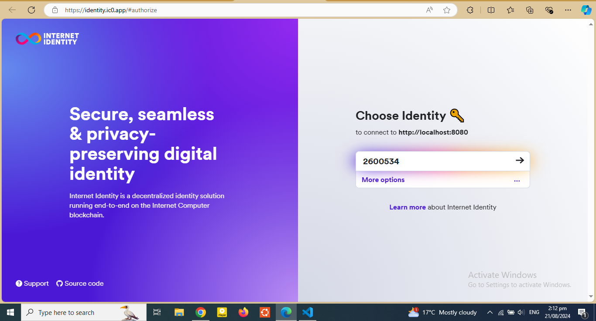
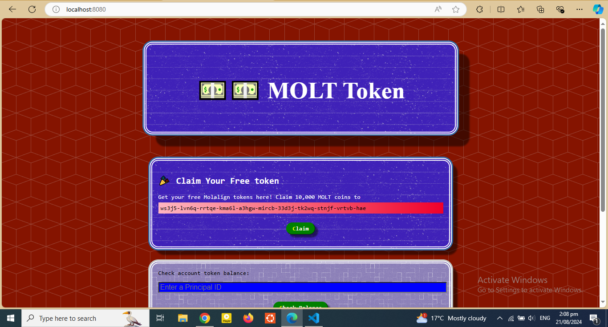
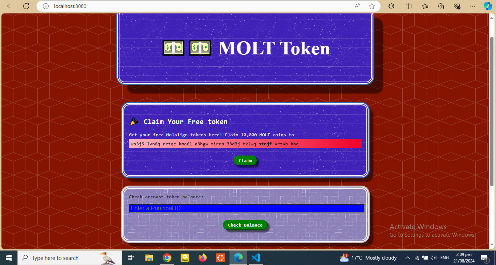
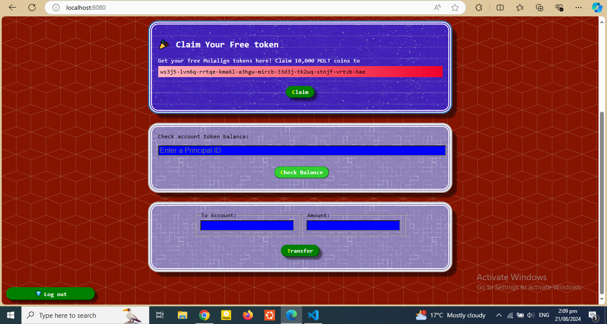
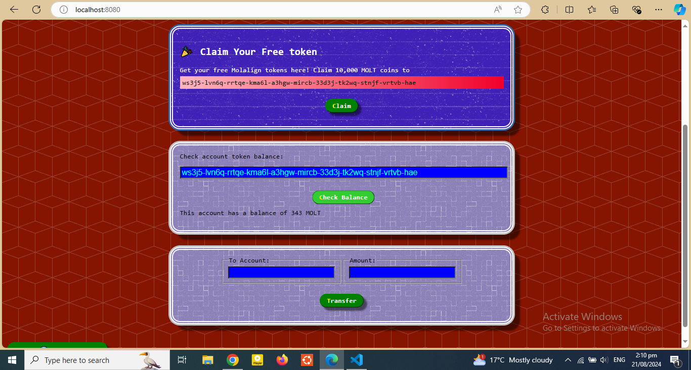
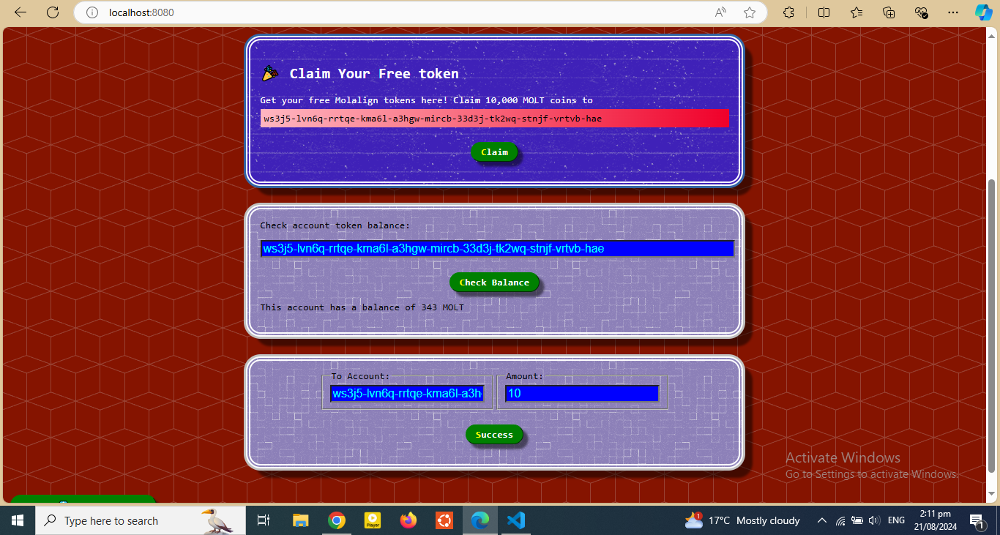
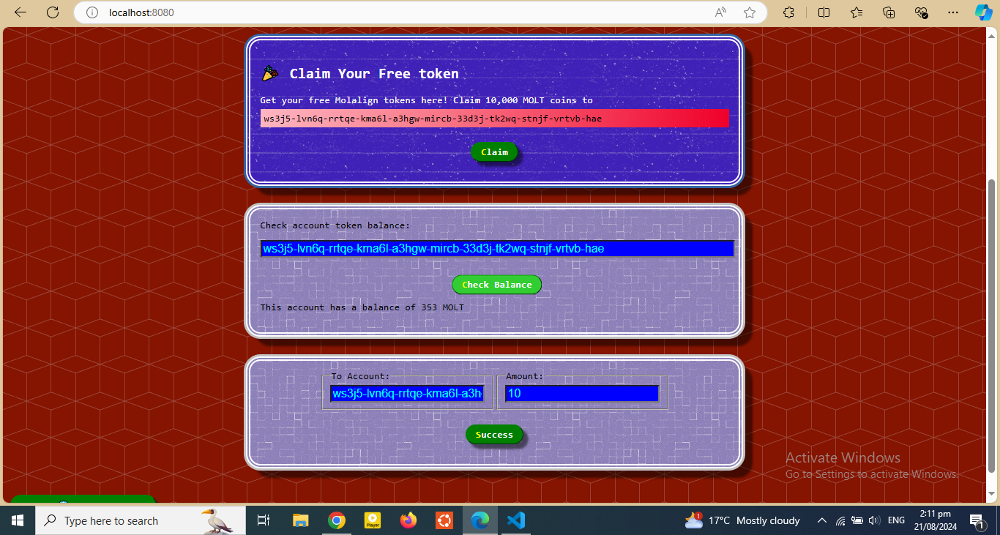

#  MOLT Token Web 3.0 Project
This project provides a user-friendly interface for interacting with MOLT tokens. Users can:

- Claim Tokens: Enter a Claim to receive 10,000 MOLT coins.
- Check Balance: Input a Principal ID to view their token balance after Login.
- Transfer Tokens: Transfer tokens to another account easily.

# page functionality

1. Login with intern identity account


2. Then this page 



3. Then user can calim free 10000 token because of interact with my website



4. user can check its token balance by inputting its account number
 

5. user can transfer its token to other account by inputing the user account and amount



6. user can log out after completing all stafe






# Check your Balance

1. Find out your principal id:

```
dfx identity get-principal
```

2. Save it somewhere.

e.g. My principal id is: b2ho5-3qdub-ubx4a-5bs54-zruxq-fs37t-calfj-bpbgh-65l26-klliv-lae


3. Format and store it in a command line variable:
```
OWNER_PUBLIC_KEY="principal \"$( \dfx identity get-principal )\""
```

4. Check that step 3 worked by printing it out:
```
echo $OWNER_PUBLIC_KEY
```

5. Check the owner's balance:
```
dfx canister call token balanceOf "( $OWNER_PUBLIC_KEY )"
```

# Charge the Canister


1. Check canister ID:
```
dfx canister id token
```

2. Save canister ID into a command line variable:
```
CANISTER_PUBLIC_KEY="principal \"$( \dfx canister id token )\""
```

3. Check canister ID has been successfully saved:
```
echo $CANISTER_PUBLIC_KEY
```

4. Transfer half a billion tokens to the canister Principal ID:
```
dfx canister call token transfer "($CANISTER_PUBLIC_KEY, 500_000_000)"
```

# Deploy the Project to the Live IC Network

1. Create and deploy canisters:

```
dfx deploy --network ic
```

2. Check the live canister ID:
```
dfx canister --network ic id token
```

3. Save the live canister ID to a command line variable:
```
LIVE_CANISTER_KEY="principal \"$( \dfx canister --network ic id token )\""
```

4. Check that it worked:
```
echo $LIVE_CANISTER_KEY
```

5. Transfer some tokens to the live canister:
```
dfx canister --network ic call token transfer "($LIVE_CANISTER_KEY, 50_000_000)"
```

6. Get live canister front-end id:
```
dfx canister --network ic id token_assets
```
7. Copy the id from step 6 and add .raw.ic0.app to the end to form a URL.
e.g. zdv65-7qaaa-aaaai-qibdq-cai.raw.ic0.app